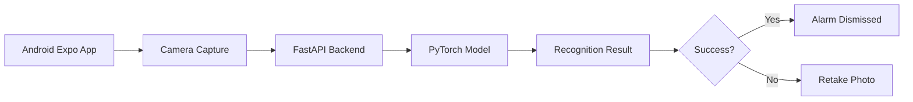
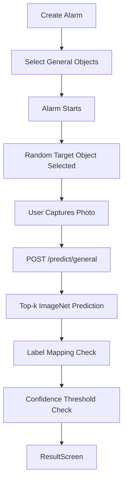
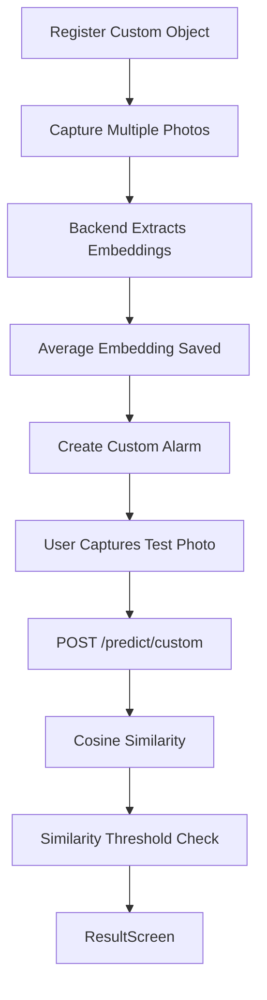

# 시스템 아키텍처

## 전체 구조

AI Object Recognition Alarm App은 Android mobile app과 FastAPI backend로 구성된다. mobile app은 사용자의 알람 설정, 카메라 촬영, 결과 화면 표시를 담당하고, backend는 PyTorch model inference를 수행한다.

## General Object Mode Flow

`General Object Mode`는 ImageNet pretrained model의 top-k prediction을 사용한다. user-facing target object와 ImageNet label이 다를 수 있기 때문에 label mapping이 필요하다.

## Custom Object Mode Flow

`Custom Object Mode`는 사용자가 등록한 object embedding을 기준으로 테스트 이미지 embedding과 cosine similarity를 계산한다.

## Server-Based Inference를 사용한 이유

본 프로젝트는 PyTorch pretrained model과 custom embedding 비교를 FastAPI backend에서 수행한다. 이 방식은 Expo Go 환경에서 구현하기 쉽고, Python 기반 PyTorch inference를 그대로 사용할 수 있다는 장점이 있다.

## On-Device Inference가 Future Work인 이유

현재 앱은 backend가 실행 중이어야 AI recognition이 가능하다. on-device inference를 사용하면 backend 없이도 동작할 수 있지만, TensorFlow Lite, PyTorch Mobile, ExecuTorch 같은 추가 변환과 Android native integration이 필요하다. 따라서 본 프로젝트에서는 server-based inference를 사용하고, on-device inference는 향후 개선 사항으로 남긴다.
